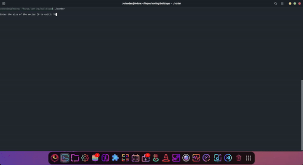

# Terminal Sorting Algorithm Visualizer

## Project Description

This C++ project provides a visual representation of various sorting algorithms in the terminal. It aims to help users understand how different sorting algorithms work by displaying the sorting process step-by-step.

## Features

- Visualize multiple sorting algorithms including:
  - Bubble Sort
  - Insertion Sort
  - Selection Sort
  - Quick Sort
  - Merge Sort
- Real-time updates of array state in the terminal
- Customizable array size and delay between steps

## Getting Started

- make
- cd build
- cmake -S .. -B . -DENABLE_DEBUG=ON
- cmake --build .
- cd app
- ./sorter
